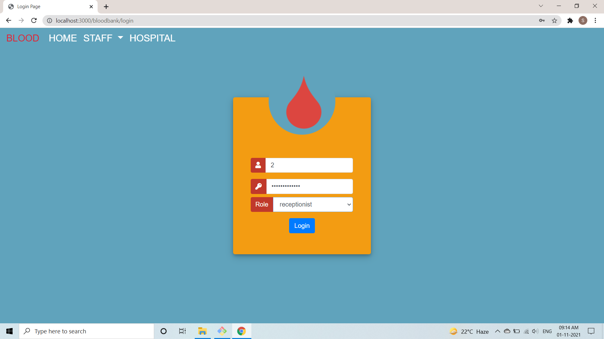
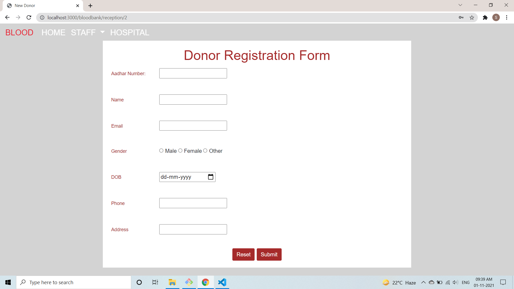
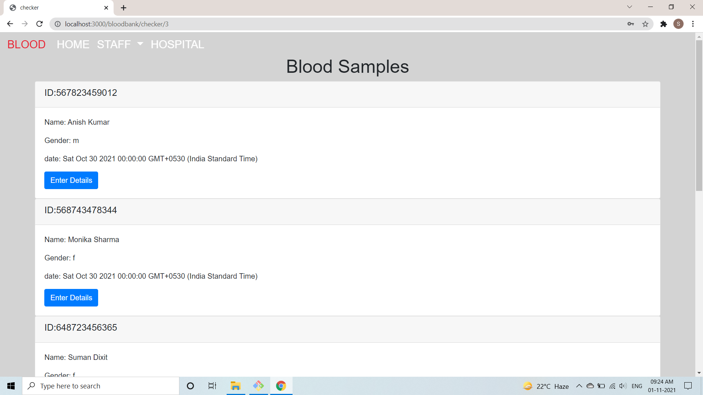
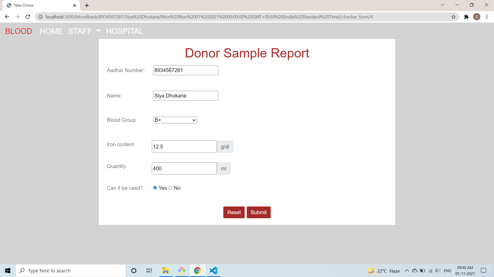
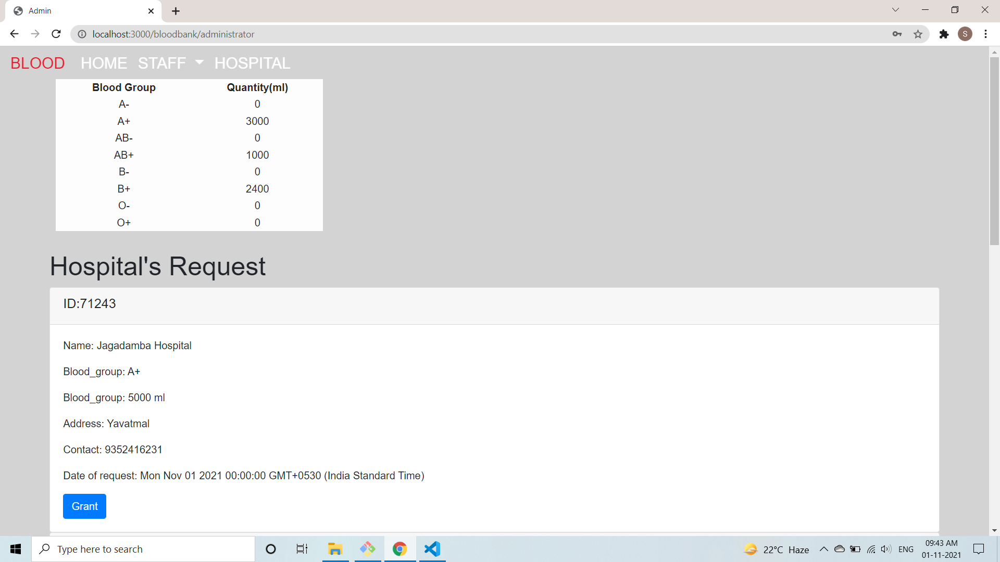
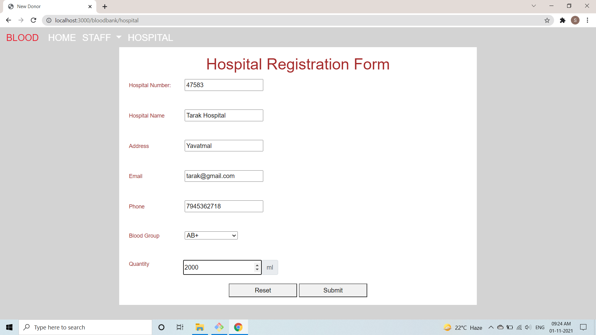
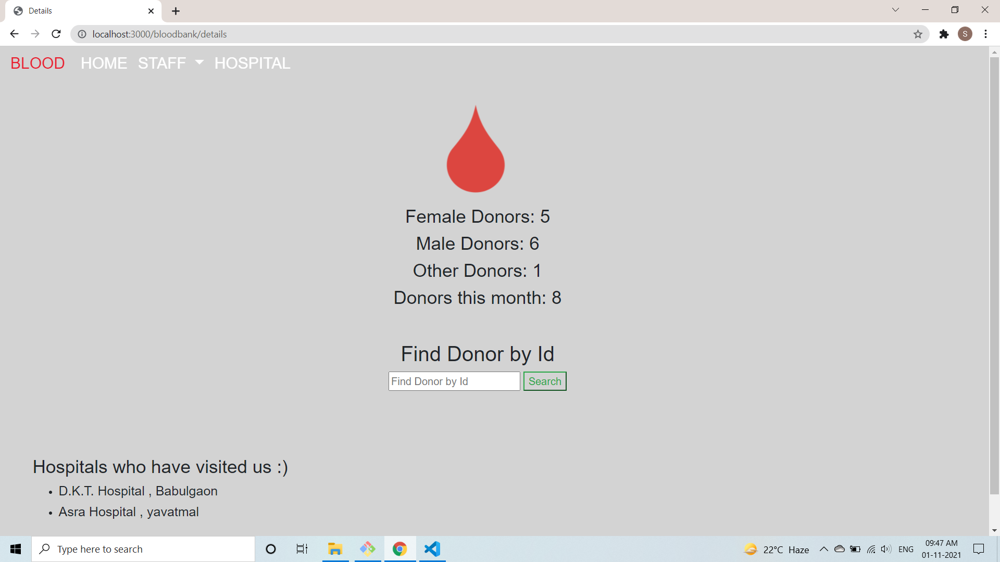

Blood bank management system DBMS Project sem 5 COLLEGE OF ENGINEERING PUNE

for receptionist: emp_id= 1 or 2; password:Reception@123

for checker: emp_id= 3 or 4; password:Checker@123

for admin: emp_id= 5; password:Admin@123

All CRUD functionalities included. commands for creating the schema are given in create_db.sql file

